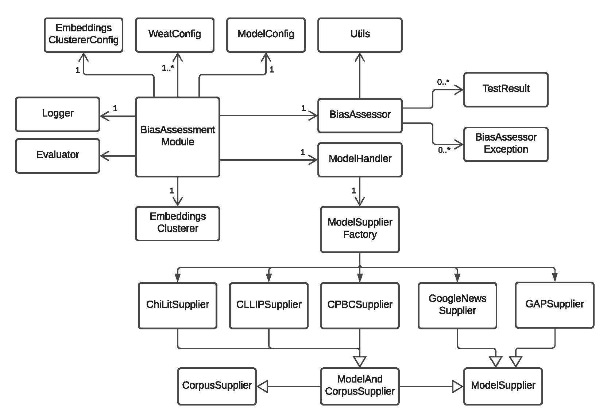

# Bias Assessment Module for Measuring Bias in Word Embeddings Trained on Children’s Literature
## Data
1) The 19th Century Children’s Literature corpus (ChiLit corpus), which amounts to 4.4 million words (Čermáková 2017),
2) The Corpus-based Learning about Language In the Primary-school (CLLIP corpus), which is part of the British National Corpus and comprises texts written for a child audience in the 20th century with a total of 820350 words (Thompson and Sealey 2007). 
3) The Children’s Picture-Book Corpus (CPB corpus), which contains a total of 65,008 words in 100 children’s picture books published in the 20th century (Montag, Jones, and Smith 2015).

GoogleNews & GAP embeddings https://github.com/alfredomg/GeBNLP2019

# Getting Started
## Interpreter
The project is developed with `Python 3.7`
## Dependencies
```
gensim==3.8.3
joblib==1.0.0
np==1.0.2
numpy==1.19.5
pandas==1.2.0
preconditions==0.1
python-dateutil==2.8.1
pytz==2020.5
scikit-learn==0.24.0
scipy==1.6.0
six==1.15.0
smart-open==4.1.0
threadpoolctl==2.1.0
```
## Installing

### Via PyCharm IDE:
* VCS -> Get from Version Control... -> URL: https://github.com/vlebedynska/word-embeddings-childrens-books.git
* Install missing libs with the PyCharm Quick Fix option 'install package'


### Via command line on Linux or macOS:
```bash
git clone https://github.com/vlebedynska/word-embeddings-childrens-books.git
cd word-embeddings-childrens-books
python3 -m venv venv
source venv/bin/activate
pip install -r requirements.txt
```

To leave the python virtual environment use `deactivate` command.


##Running
### Command line arguments
The main configuration is stored in the `config.json` file. Some of the configuration parameters stored in this file
 can be overridden on application start by passing command line arguments as listed below:

* `-h`, `--help`: show the help message and exit
* `-cr`, `--corpus`: corpus name, one of {`CLLIP_Corpus`,`ChiLit_Corpus`,`CPBC_Corpus,GAP`,`GoogleNews`}`
* `-a`, `--amount`: Amount of sub-corpora: CLLIP_Corpus and СhiLit_Corpus. Can be split in the smaller sub-corpora
* `-s`, `--size`: Dimensionality of the word vectors
* `-p`, `--permutations`: Number of permutations for a single WEAT
* `-w`, `--window`: Maximum distance between the current and predicted word within a sentence
* `-sg`, `--skipgram`: Training algorithm: `1` for skip-gram; `0` CBOW
* `-m`, `--mode`: Runining mode, one of {`WEAT`,`Clustering`,`WEAT_and_Clustering`}`


### Bias category preselection

Before starting the Bias Assessment Module, bias categories can be selected, on which the WEATTs will be performed in the module.
Following categories are supported: 

* For WEAT mode:
    * G1_career_vs_family
    * G2_maths_vs_arts
    * G3_science_vs_arts
    * G4_intelligence_vs_appearance
    * G5_strength_vs_weakness
    * RL1_Christianity_vs_Islam
    * RL2_Christianity_vs_Judaism
    * RL3_Judaism_vs_Islam
    * AG1_young_vs_old
    * A1_flowers_vs_insects
    * A2_innocent_sheep_vs_cruel_wolf
    * A3_naive_bird_vs_clever_fox
    * A4_strong_lion_vs_tender_mouse
    * A5_faithful_dog_vs_selfish_cat
    * CR1_European_American_vs_African_American
    * CG1_math_vs_reading
    * CG2_math_vs_reading
    * CA1_flowers_vs_insects
    
* For clustering mode:
    * CG1_math_vs_reading
    * CG2_math_vs_reading
    * CA1_flowers_vs_insects

By default all of these categories are used by the module.
To unselect certain categories user can comment out them in `bias_assessment_module/WeatTester.py` file before starting the application.
Here is an example with selected bias categories commented out:
```python
    if mode == "WEAT" or mode == "WEAT_and_Clustering":

        # comment out categories for which the WEAT should not be executed
        bias_categories = [
            "G1_career_vs_family",
#            "G2_maths_vs_arts",
#            "G3_science_vs_arts",
#            "G4_intelligence_vs_appearance",
#            "G5_strength_vs_weakness",
#            "RL1_Christianity_vs_Islam",
#            "RL2_Christianity_vs_Judaism",
#            "RL3_Judaism_vs_Islam",
#            "AG1_young_vs_old",
#            "A1_flowers_vs_insects",
#            "A2_innocent_sheep_vs_cruel_wolf",
#            "A3_naive_bird_vs_clever_fox",
            "A4_strong_lion_vs_tender_mouse",
#            "A5_faithful_dog_vs_selfish_cat",
#            "CR1_European_American_vs_African_American",
            "CG1_math_vs_reading",
#            "CG2_math_vs_reading",
#            "CA1_flowers_vs_insects"
        ]
        module.run_weat(bias_categories)

    if mode == "Clustering" or mode == "WEAT_and_Clustering":

        # comment out categories for which the WEAT should not be executed
        bias_categories_to_cluster = [
            "CG1_math_vs_reading",
            "CG2_math_vs_reading",
            "CA1_flowers_vs_insects"
        ]
        module.run_weat_with_clusters(bias_categories_to_cluster)

```

### Via PyCharm IDE
Run `bias_assessment_module/WeatTester` with the following change in 'Run Configuration' dialog: set 'Working directory' to
`/path/to/the/project/word-embeddings-childrens-books`

### Via command line on Linux or macOS:

```
export PYTHONPATH=.
python bias_assessment_module/WeatTester.py
```
The environment variable `PYTHONPATH` need to be set lo project directory before starting the application. 
The application can be executed via the command line `python bias_assessment_module/WeatTester.py`.


# Class structure



